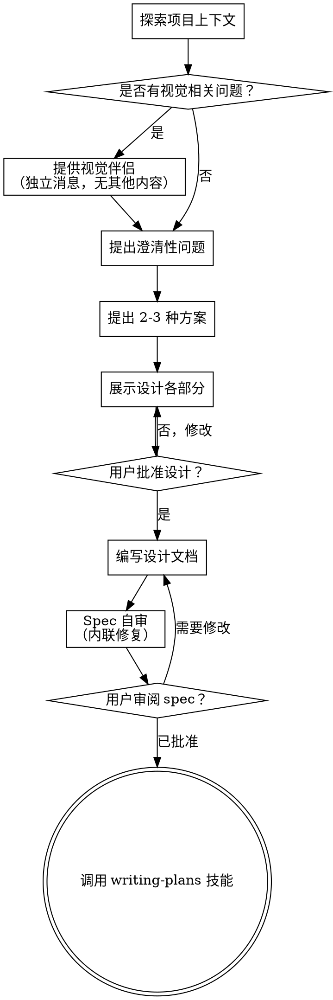

# 头脑风暴：从想法到设计

通过自然的协作对话，帮助将想法转化为完整的设计和 spec（规格文档）。

首先了解当前项目上下文，然后逐个提问来细化想法。一旦你理解了要构建的内容，就展示设计方案并获得用户批准。

<HARD-GATE>
在你展示设计方案并获得用户批准之前，不要调用任何实现技能、编写任何代码、搭建任何项目脚手架，或采取任何实现行动。这适用于所有项目，无论看起来多简单。
</HARD-GATE>

## 反模式："这太简单了，不需要设计"

每个项目都要经过这个流程。待办列表、单函数工具、配置变更——全都如此。"简单"的项目恰恰是未经审视的假设造成最多返工的地方。设计可以很简短（对于真正简单的项目几句话即可），但你必须展示设计并获得批准。

## 检查清单

你必须为以下每一项创建任务，并按顺序完成：

1. **探索项目上下文** — 检查文件、文档、最近的提交
2. **提供视觉伴侣**（如果主题涉及视觉相关问题）— 这是一条独立消息，不与澄清性问题合并。参见下方"视觉伴侣"章节。
3. **提出澄清性问题** — 逐个提问，理解目的/约束/成功标准
4. **提出 2-3 种方案** — 包含权衡分析和你的推荐
5. **展示设计** — 按各部分的复杂度调整篇幅，每个部分展示后获取用户确认
6. **编写设计文档** — 保存到 `docs/superpowers/specs/YYYY-MM-DD-<topic>-design.md` 并提交
7. **Spec 自审** — 快速内联检查占位符、矛盾、歧义、范围（见下文）
8. **用户审阅已编写的 spec** — 请用户在继续之前审阅 spec 文件
9. **过渡到实现** — 调用 writing-plans 技能来创建实现计划

## 流程图

**终态是调用 writing-plans。** 不要调用 frontend-design、mcp-builder 或任何其他实现技能。头脑风暴之后唯一应调用的技能是 writing-plans。

## 流程详解

**理解想法：**

- 首先查看当前项目状态（文件、文档、最近的提交）
- 在提出详细问题之前，先评估范围：如果请求描述了多个独立子系统（例如"构建一个包含聊天、文件存储、计费和分析的平台"），请立即指出。不要在一个需要先行拆解的项目上花时间细化细节。
- 如果项目太大，无法用单个 spec 覆盖，帮助用户拆解为子项目：有哪些独立的部分、它们之间有什么关系、应该按什么顺序构建？然后按照正常的设计流程对第一个子项目进行头脑风暴。每个子项目都有自己的 spec → 计划 → 实现 循环。
- 对于范围适当的项目，逐个提问来细化想法
- 尽量使用选择题，开放性问题也可以
- 每条消息只问一个问题——如果一个主题需要更多探讨，拆成多个问题
- 聚焦于理解：目的、约束、成功标准

**探索方案：**

- 提出 2-3 种不同方案，分析各自的权衡
- 以对话方式展示选项，附上你的推荐及理由
- 先介绍你推荐的方案并解释原因

**展示设计：**

- 当你认为已经理解了要构建的内容时，展示设计方案
- 每个部分的篇幅与其复杂度匹配：简单的几句话，复杂的可以到 200-300 字
- 每展示一个部分后询问用户是否正确
- 涵盖：架构、组件、数据流、错误处理、测试
- 如果有不清楚的地方，随时回头澄清

**为隔离性和清晰性而设计：**

- 将系统拆分为更小的单元，每个单元有一个明确的职责，通过定义良好的接口通信，可以独立理解和测试
- 对于每个单元，你应该能回答：它做什么、如何使用它、它依赖什么？
- 别人能否不看内部实现就理解一个单元的功能？你能否在不破坏消费者的情况下修改内部实现？如果不能，边界需要调整。
- 更小、边界清晰的单元也更便于你操作——你对能一次放入上下文的代码推理更准确，对聚焦性文件的编辑也更可靠。当文件变得很大时，通常意味着它做了太多事情。

**在已有代码库中工作：**

- 在提出变更之前，先探索当前结构。遵循现有模式。
- 如果现有代码存在影响当前工作的问题（例如文件过大、边界不清、职责纠缠），将有针对性的改进纳入设计——就像优秀的开发者在工作中改进他们接触的代码一样。
- 不要提出无关的重构。专注于服务当前目标。

## 设计完成后

**文档：**

- 将验证通过的设计（spec）写入 `docs/superpowers/specs/YYYY-MM-DD-<topic>-design.md`
  - （用户对 spec 存放位置的偏好会覆盖此默认值）
- 如果可用，使用 elements-of-style:writing-clearly-and-concisely 技能
- 将设计文档提交到 `git`

**Spec 自审：**
编写 spec 文档后，以全新的视角审视它：

1. **占位符扫描：** 有没有 "TBD"、"TODO"、不完整的章节或模糊的需求？修复它们。
2. **内部一致性：** 各章节之间是否有矛盾？架构设计是否与功能描述匹配？
3. **范围检查：** 这个 spec 是否足够聚焦，能作为单个实现计划？还是需要进一步拆解？
4. **歧义检查：** 有没有需求可以被两种方式解读？如果有，选择一种并明确写出。

内联修复所有问题。无需重新审阅——修复后继续即可。

**用户审阅关卡：**
Spec 自审通过后，请用户在继续之前审阅已编写的 spec：

> "Spec 已编写并提交到 `<path>`。请审阅它，如果在我们开始编写实现计划之前你想做任何修改，请告诉我。"

等待用户回复。如果他们要求修改，进行修改并重新运行 spec 自审流程。只有在用户批准后才继续。

**实现：**

- 调用 writing-plans 技能来创建详细的实现计划
- 不要调用任何其他技能。writing-plans 是下一步。

## 核心原则

- **每次只问一个问题** — 不要用大量问题淹没用户
- **优先使用选择题** — 在可能的情况下，比开放性问题更容易回答
- **严格遵循 YAGNI** — 从所有设计中移除不必要的功能
- **探索替代方案** — 在确定之前始终提出 2-3 种方案
- **增量验证** — 展示设计，获得批准后再继续
- **保持灵活** — 有不清楚的地方随时回头澄清

## 视觉伴侣

基于浏览器的伴侣工具，用于在头脑风暴期间展示原型、图表和视觉选项。作为工具提供——不是模式。接受视觉伴侣意味着它可用于受益于视觉表现的问题；并不意味着每个问题都通过浏览器展示。

**提供视觉伴侣：** 当你预计即将到来的问题会涉及视觉内容（原型、布局、图表）时，请求一次授权：
> "我们正在讨论的一些内容如果能在浏览器中展示给你看，可能会更容易理解。我可以在讨论过程中制作原型、图表、对比图和其他视觉素材。这个功能还比较新，可能会消耗较多 token。要试试吗？（需要打开一个本地 URL）"

**这个请求必须作为独立消息发送。** 不要将其与澄清性问题、上下文总结或任何其他内容合并。消息中应该只包含上述请求，不包含其他任何内容。等待用户回复后再继续。如果他们拒绝，则继续纯文本头脑风暴。

**逐个问题决策：** 即使用户接受了，也要为每个问题单独决定是使用浏览器还是终端。判断标准：**用户看到它是否比读到它更容易理解？**

- **使用浏览器** 展示本质上是视觉的内容 — 原型、线框图、布局对比、架构图、并排视觉设计
- **使用终端** 展示本质上是文本的内容 — 需求问题、概念选择、权衡列表、A/B/C/D 文本选项、范围决策

关于 UI 主题的问题不一定是视觉问题。"在这个上下文中'个性化'是什么意思？"是一个概念性问题——使用终端。"哪种向导布局更好？"是一个视觉问题——使用浏览器。

如果他们同意使用视觉伴侣，在继续之前请阅读详细指南：
`skills/brainstorming/visual-companion.md`
