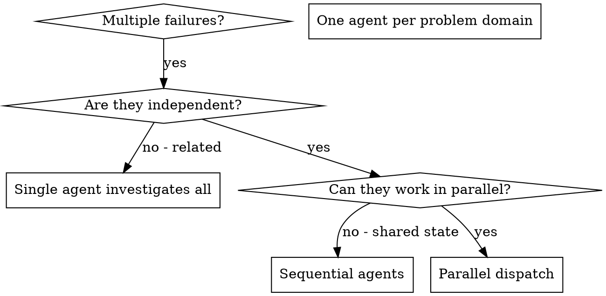

# 分派并行代理（Dispatching Parallel Agents）

## 概述

你将任务委派给拥有隔离上下文的专用代理（agent）。通过精确构造它们的指令和上下文，确保它们保持专注并完成任务。它们不应继承你的会话上下文或历史记录——你需要精确构建它们所需的内容。这也为你自己保留了协调工作的上下文空间。

当你遇到多个不相关的失败（不同的测试文件、不同的子系统、不同的 bug）时，逐个调查会浪费时间。每项调查都是独立的，可以并行进行。

**核心原则：** 每个独立问题域分派一个代理，让它们并发工作。

## 何时使用



**适用场景：**
- 3 个以上测试文件因不同根因失败
- 多个子系统独立地出现故障
- 每个问题无需其他问题的上下文即可理解
- 调查之间没有共享状态

**不适用场景：**
- 失败是关联的（修复一个可能修复其他的）
- 需要理解完整的系统状态
- 代理之间会互相干扰

## 模式

### 1. 识别独立域

按故障内容分组：
- 文件 A 测试：工具审批流程（Tool approval flow）
- 文件 B 测试：批量完成行为（Batch completion behavior）
- 文件 C 测试：中止功能（Abort functionality）

每个域是独立的——修复工具审批不会影响中止测试。

### 2. 创建聚焦的代理任务

每个代理获得：
- **明确范围：** 一个测试文件或子系统
- **清晰目标：** 让这些测试通过
- **约束条件：** 不要修改其他代码
- **期望输出：** 你发现和修复内容的摘要

### 3. 并行分派

```typescript
// In Claude Code / AI environment
Task("Fix agent-tool-abort.test.ts failures")
Task("Fix batch-completion-behavior.test.ts failures")
Task("Fix tool-approval-race-conditions.test.ts failures")
// All three run concurrently
```

### 4. 审查与整合

当代理返回时：
- 阅读每份摘要
- 验证修复不冲突
- 运行完整测试套件
- 整合所有变更

## 代理提示词（Prompt）结构

好的代理提示词应当：
1. **聚焦** — 一个明确的问题域
2. **自包含** — 理解问题所需的全部上下文
3. **明确输出要求** — 代理应该返回什么？

```markdown
Fix the 3 failing tests in src/agents/agent-tool-abort.test.ts:

1. "should abort tool with partial output capture" - expects 'interrupted at' in message
2. "should handle mixed completed and aborted tools" - fast tool aborted instead of completed
3. "should properly track pendingToolCount" - expects 3 results but gets 0

These are timing/race condition issues. Your task:

1. Read the test file and understand what each test verifies
2. Identify root cause - timing issues or actual bugs?
3. Fix by:
   - Replacing arbitrary timeouts with event-based waiting
   - Fixing bugs in abort implementation if found
   - Adjusting test expectations if testing changed behavior

Do NOT just increase timeouts - find the real issue.

Return: Summary of what you found and what you fixed.
```

## 常见错误

**❌ 范围过广：** "修复所有测试" — 代理会迷失方向
**✅ 具体明确：** "修复 agent-tool-abort.test.ts" — 聚焦的范围

**❌ 缺少上下文：** "修复竞态条件" — 代理不知道在哪里
**✅ 提供上下文：** 粘贴错误消息和测试名称

**❌ 没有约束：** 代理可能重构所有代码
**✅ 设定约束：** "不要修改生产代码" 或 "只修复测试"

**❌ 输出模糊：** "修好它" — 你不知道改了什么
**✅ 明确输出：** "返回根因和变更的摘要"

## 何时不应使用

**关联失败：** 修复一个可能修复其他的 — 先一起调查
**需要完整上下文：** 理解问题需要看到整个系统
**探索性调试：** 你还不知道什么坏了
**共享状态：** 代理会互相干扰（编辑同一文件、使用同一资源）

## 真实会话示例

**场景：** 大规模重构后，3 个文件中出现 6 个测试失败

**失败情况：**
- agent-tool-abort.test.ts：3 个失败（时序问题）
- batch-completion-behavior.test.ts：2 个失败（工具未执行）
- tool-approval-race-conditions.test.ts：1 个失败（执行计数 = 0）

**决策：** 独立域 — 中止逻辑与批量完成与竞态条件彼此独立

**分派：**
```
Agent 1 → Fix agent-tool-abort.test.ts
Agent 2 → Fix batch-completion-behavior.test.ts
Agent 3 → Fix tool-approval-race-conditions.test.ts
```

**结果：**
- Agent 1：用基于事件的等待替换了超时
- Agent 2：修复了事件结构 bug（threadId 位置错误）
- Agent 3：添加了对异步工具执行完成的等待

**整合：** 所有修复互相独立，无冲突，完整测试套件全绿

**节省的时间：** 3 个问题并行解决 vs 串行解决

## 关键收益

1. **并行化** — 多项调查同时进行
2. **聚焦** — 每个代理范围窄，需要跟踪的上下文更少
3. **独立性** — 代理之间互不干扰
4. **速度** — 3 个问题在 1 个问题的时间内解决

## 验证

代理返回后：
1. **审查每份摘要** — 理解改了什么
2. **检查冲突** — 代理是否编辑了相同的代码？
3. **运行完整测试套件** — 验证所有修复协同工作
4. **抽查** — 代理可能犯系统性错误

## 实际影响

来自调试会话（2025-10-03）：
- 3 个文件中 6 个失败
- 并行分派 3 个代理
- 所有调查并发完成
- 所有修复成功整合
- 代理变更之间零冲突

## Gem Agent 并行分派

如果安装了 Gem agents，以下 agents 特别适合并行分派：

| Agent | 并行场景 | 最大并发 |
|-------|---------|----------|
| `gem-researcher` | 多领域/多模块研究 | 4 |
| `gem-implementer` | 同一 wave 内无冲突的实现任务 | 4（fast 模式 6-8）|
| `gem-reviewer` + `gem-critic` | 审查和批判可并行运行 | 各 1 |

分派 Gem agents 时同样遵守本技能的冲突检查规则：共享相同文件的任务必须串行。
