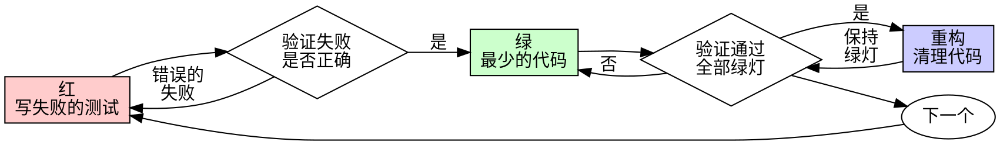

# 测试驱动开发（TDD）

## 概述

先写测试。看它失败。写最少的代码让它通过。

**核心原则：** 如果你没有看到测试失败，你就不知道它是否测试了正确的东西。

**违反规则的字面意思就是违反规则的精神。**

## 何时使用

**始终使用：**
- 新功能
- Bug 修复
- 重构（refactoring）
- 行为变更

**例外（请咨询你的人类搭档）：**
- 一次性原型
- 生成的代码
- 配置文件

在想"就这一次跳过 TDD"？停下来。那是合理化借口。

## 铁律

```
没有失败的测试，就不能写生产代码
```

在测试之前写了代码？删掉。重新开始。

**没有例外：**
- 不要把它留作"参考"
- 不要在写测试时"改编"它
- 不要看它
- 删除就是删除

从测试出发，全新实现。句号。

## 红-绿-重构



### 红 - 写失败的测试

写一个最小的测试，展示预期行为。

<Good>
```typescript
test('retries failed operations 3 times', async () => {
  let attempts = 0;
  const operation = () => {
    attempts++;
    if (attempts < 3) throw new Error('fail');
    return 'success';
  };

  const result = await retryOperation(operation);

  expect(result).toBe('success');
  expect(attempts).toBe(3);
});
```
名称清晰，测试真实行为，只测一件事
</Good>

<Bad>
```typescript
test('retry works', async () => {
  const mock = jest.fn()
    .mockRejectedValueOnce(new Error())
    .mockRejectedValueOnce(new Error())
    .mockResolvedValueOnce('success');
  await retryOperation(mock);
  expect(mock).toHaveBeenCalledTimes(3);
});
```
名称模糊，测试的是 mock 而不是代码
</Bad>

**要求：**
- 只测一个行为
- 名称清晰
- 使用真实代码（除非不得已才用 mock）

### 验证红 - 看它失败

**必做。绝不跳过。**

```bash
npm test path/to/test.test.ts
```

确认：
- 测试失败（不是报错）
- 失败信息符合预期
- 因为功能缺失而失败（不是因为拼写错误）

**测试通过了？** 你在测试已有的行为。修改测试。

**测试报错了？** 修复错误，重新运行直到它正确地失败。

### 绿 - 最少的代码

写最简单的代码让测试通过。

<Good>
```typescript
async function retryOperation<T>(fn: () => Promise<T>): Promise<T> {
  for (let i = 0; i < 3; i++) {
    try {
      return await fn();
    } catch (e) {
      if (i === 2) throw e;
    }
  }
  throw new Error('unreachable');
}
```
刚好够让测试通过
</Good>

<Bad>
```typescript
async function retryOperation<T>(
  fn: () => Promise<T>,
  options?: {
    maxRetries?: number;
    backoff?: 'linear' | 'exponential';
    onRetry?: (attempt: number) => void;
  }
): Promise<T> {
  // YAGNI（你不会需要它的）
}
```
过度工程
</Bad>

不要添加功能、重构其他代码，也不要做超出测试范围的"改进"。

### 验证绿 - 看它通过

**必做。**

```bash
npm test path/to/test.test.ts
```

确认：
- 测试通过
- 其他测试仍然通过
- 输出干净（没有错误、警告）

**测试失败了？** 修改代码，不是修改测试。

**其他测试失败了？** 立即修复。

### 重构 - 清理代码

只在绿灯之后：
- 消除重复
- 改善命名
- 提取辅助函数

保持测试绿灯。不要添加新行为。

### 重复

为下一个功能写下一个失败的测试。

## 好的测试

| 质量 | 好 | 坏 |
|------|-----|-----|
| **最小化** | 只测一件事。名称里有"和"？拆分它。 | `test('validates email and domain and whitespace')` |
| **清晰** | 名称描述行为 | `test('test1')` |
| **展示意图** | 展示期望的 API | 掩盖代码应该做什么 |

## 为什么顺序很重要

**"我先写代码，之后再写测试来验证"**

先写代码再写的测试会立即通过。立即通过说明不了任何问题：
- 可能测错了东西
- 可能测试的是实现而非行为
- 可能遗漏了你忘记的边界情况
- 你从未看到它捕获过 bug

先写测试迫使你看到测试失败，证明它确实在测试某些东西。

**"我已经手动测试了所有边界情况"**

手动测试是临时性的。你以为你测试了所有情况，但是：
- 没有测试内容的记录
- 代码变更后无法重新运行
- 在压力下容易遗漏情况
- "我试过没问题" ≠ 全面的测试

自动化测试是系统性的。每次都以相同方式运行。

**"删除 X 小时的工作是浪费"**

沉没成本谬误（sunk cost fallacy）。时间已经花了。你现在的选择是：
- 删除并用 TDD 重写（再花 X 小时，高置信度）
- 保留并事后补测试（30 分钟，低置信度，可能有 bug）

真正的"浪费"是保留你无法信任的代码。没有真实测试的可运行代码就是技术债务。

**"TDD 太教条了，务实意味着灵活变通"**

TDD 本身就是务实的：
- 在提交前发现 bug（比提交后调试更快）
- 防止回归（测试立即捕获破坏）
- 记录行为（测试展示如何使用代码）
- 支持重构（放心修改，测试捕获破坏）

"务实"的捷径 = 在生产环境调试 = 更慢。

**"事后写测试也能达到同样目的——重要的是精神而非仪式"**

不对。事后的测试回答的是"这段代码做了什么？" 先写的测试回答的是"这段代码应该做什么？"

事后的测试被你的实现所偏向。你测试的是你构建的东西，而不是需求要求的东西。你验证的是你记得的边界情况，而不是被发现的边界情况。

先写测试迫使你在实现之前发现边界情况。事后写测试验证的是你是否记住了所有情况（你没有）。

30 分钟的事后测试 ≠ TDD。你得到了覆盖率，却失去了测试有效的证明。

## 常见的合理化借口

| 借口 | 现实 |
|------|------|
| "太简单了不需要测试" | 简单的代码也会出 bug。测试只需 30 秒。 |
| "我之后再测试" | 立即通过的测试什么也证明不了。 |
| "事后写测试也能达到同样目的" | 事后测试 ="这做了什么？" 先写测试 ="这应该做什么？" |
| "已经手动测试过了" | 临时的 ≠ 系统的。没有记录，无法重新运行。 |
| "删除 X 小时的工作是浪费" | 沉没成本谬误。保留未验证的代码才是技术债务。 |
| "留作参考，先写测试" | 你会改编它的。那就是事后补测试。删除就是删除。 |
| "需要先探索" | 可以。扔掉探索的代码，然后从 TDD 开始。 |
| "测试难写 = 设计不清楚" | 听测试的话。难测试 = 难使用。 |
| "TDD 会拖慢我的速度" | TDD 比调试更快。务实 = 先写测试。 |
| "手动测试更快" | 手动测试无法证明边界情况。每次修改都要重新测试。 |
| "现有代码没有测试" | 你正在改进它。为现有代码补充测试。 |

## 危险信号 - 停下来，重新开始

- 测试之前就写了代码
- 实现之后才写测试
- 测试立即通过
- 无法解释测试为什么失败
- 测试"以后再加"
- 在给"就这一次"找借口
- "我已经手动测试过了"
- "事后写测试也能达到同样目的"
- "重要的是精神而非仪式"
- "留作参考"或"改编现有代码"
- "已经花了 X 小时，删了太浪费"
- "TDD 太教条了，我只是务实"
- "这次不一样，因为……"

**以上所有情况都意味着：删除代码。用 TDD 重新开始。**

## 示例：Bug 修复

**Bug：** 空邮箱被接受了

**红**
```typescript
test('rejects empty email', async () => {
  const result = await submitForm({ email: '' });
  expect(result.error).toBe('Email required');
});
```

**验证红**
```bash
$ npm test
FAIL: expected 'Email required', got undefined
```

**绿**
```typescript
function submitForm(data: FormData) {
  if (!data.email?.trim()) {
    return { error: 'Email required' };
  }
  // ...
}
```

**验证绿**
```bash
$ npm test
PASS
```

**重构**
如果需要，提取验证逻辑用于多个字段。

## 验证清单

在标记工作完成之前：

- [ ] 每个新函数/方法都有测试
- [ ] 每个测试在实现之前都看到了失败
- [ ] 每个测试因预期原因失败（功能缺失，而非拼写错误）
- [ ] 为每个测试写了最少的代码使其通过
- [ ] 所有测试通过
- [ ] 输出干净（没有错误、警告）
- [ ] 测试使用真实代码（仅在不可避免时使用 mock）
- [ ] 边界情况和错误情况都已覆盖

无法全部勾选？你跳过了 TDD。重新开始。

## 遇到困难时

| 问题 | 解决方案 |
|------|----------|
| 不知道如何测试 | 写出你期望的 API。先写断言。问你的人类搭档。 |
| 测试太复杂 | 设计太复杂。简化接口。 |
| 必须 mock 一切 | 代码耦合太紧。使用依赖注入（dependency injection）。 |
| 测试启动代码太庞大 | 提取辅助函数。仍然复杂？简化设计。 |

## 调试集成

发现了 bug？写一个能复现它的失败测试。遵循 TDD 循环。测试证明了修复有效，并防止回归。

永远不要在没有测试的情况下修复 bug。

## 测试反模式

在添加 mock 或测试工具时，阅读 @testing-anti-patterns.md 以避免常见陷阱：
- 测试 mock 的行为而非真实行为
- 向生产类添加仅用于测试的方法
- 在不理解依赖关系的情况下使用 mock

## 最终规则

```
生产代码 → 必须先有一个失败的测试
否则 → 不是 TDD
```

未经你的人类搭档许可，没有例外。
